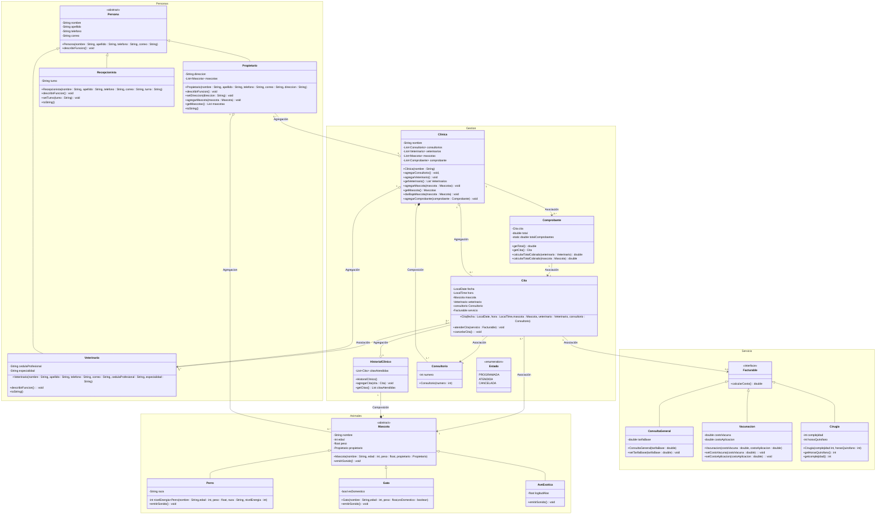

# Diagrama de Clases UML

```mermaid
classDiagram
    %% Paquete personas
    namespace Personas {
        
        class Persona{
            <<abstract>>
            -String nombre
            -String apellido
            -String telefono
            -String correo
            +Persona(nombre : String, apellido : String, telefono : String, correo : String)
            +describirFuncion()*  void
        }   
        class Propietario{
            -String direccion
            -List~Mascota~ mascotas
            +Propietario(nombre : String, apellido : String, telefono : String, correo : String, direccion : String )
            +describirFuncion()void 
            +setDireccion(direccion : String)  void 
            +agregarMascota(mascota : Mascota)  void
            +getMascotas() List mascotas
            +toString()
        }
        class Veterinario{
            -String cedulaProfesional
            -String especialidad
            +Veterinario(nombre : String, apellido : String, telefono : String, correo : String, cedulaProfesional : String, especialidad : String)
            +describirFuncion() : void  
            +toString()
        }
        class Recepcionista{
            -String turno
            +Recepcionista(nombre : String, apellido : String, telefono : String, correo : String, turno : String) 
            +describirFuncion() void 
            +setTurno(turno : String)  void 
            +toString()
        }
    }
   
    namespace Animales {
        class Mascota{
            <<abstract>>
            -String nombre
            -int edad
            -float peso
            -Propietario propietario
            +Mascota(nombre : String, edad : int, peso : float, propietario : Propietario)
            +emitirSonido()* void
        }
        class Perro{
            -String raza
            -int nivelEnergia+Perro(nombre : String,edad : int, peso : float, raza : String, nivelEnergia : int)
            +emitirSonido() void
        }    
        class Gato{
            -bool esDomestico
            +Gato(nombre : String,edad : int, peso : float,esDomestico : boolean)
            +emitirSonido() void
        }
        class AveExotica{
            -float logitudAlas
            +emitirSonido() void
        }
    }
    
    namespace Servicio {
        
        class Facturable{
            <<interface>>
            +calcularCosto() double
        }

        class ConsultaGeneral{
            -double tarifaBase
            +ConsultaGeneral(tarifaBase : double)
            +setTarifaBase(tarifaBase : double)  void
        }
        
        class Vacunacion{
            -double costoVacuna
            -double costoAplicacion
            +Vacunacion(costoVacuna : double, costoAplicacion : double)
            +setCostoVacuna(costoVacuna : double) : void
            +setCostoAplicacion(costoAplicacion : double) : void
        }
        
        class Cirugia{
            -int complejidad
            -int horasQuirofano
            +Cirugia(complejidad int, horasQuirofano : int)
            +getHorasQuirofano() int
            +getcomplejidad() int
        }
    }
    
    namespace Gestion {
        class HistorialClinico{
            -List~Cita~ citasAtendidas
            +HistoralClinico()
            +agregarCita(cita : Cita) void
            +getCitas() List citasAtendidas
        }
        class Clinica{
            -String nombre
            -List~Consultorio~ consultorios
            -List~Veterinario~ veterinarios
            -List~Mascota~ mascotas
            -List~Comprobante~ comprobante
            +Clinica(nombre : String) 
            +agregarConsultorio()  void, 
            +agregarVeterinario() void
            +getVeterinario() List Veterinarios 
            +agregarMascota(mascota : Mascotas)  void
            +getMascota() Mascotas
            +darBajaMascota(mascota : Mascota) void
            +agregarComprobante(comprobante : Comprobante) void
        }
        class Consultorio{
            -int numero
            +Consultorio(numero : int)
        }
        class Cita{
            -LocalDate fecha
            -LocalTime hora
            -Mascota mascota
            -Veterinario veterinario
            -consultorio Consultorio
            -Facturable servicio
            +Cita(fecha : LocalDate, hora : LocalTime,mascota : Mascota, veterinario : Veterinario, consultorio : Consultorio) 
            +atenderCita(servicio : Facturable) void
            +cancelarCita() : void
        }
        class Estado{
            <<enumeration>>
            PROGRAMADA
            ATENDIDA
            CANCELADA
        }
        class Comprobante {
            -Cita cita
            -double total
            -static double totalComprobantes
            +getTotal() double
            +getCita() Cita
            +calcularTotalCobrado(veterinario : Veterinario) double
            +calcularTotalCobrado(mascota : Mascota) double
        }
        
        
    }
    
    %%Herencias
    
    Persona <|-- Propietario
    Persona <|-- Veterinario
    Persona <|--Recepcionista
    Mascota <|-- Perro
    Mascota <|-- Gato
    Mascota <|-- AveExotica
    Facturable <|-- ConsultaGeneral
    Facturable <|-- Vacunacion
    Facturable <|-- Cirugia
    
    %%relacion 
    Mascota "0..*" --o "1" Propietario : Agregacion
    Cita "0..*" --> "1" Mascota : Asociación
    Cita "0..*" --> "1" Veterinario : Asociación
    Cita "0..*" --> "1" Consultorio : Asociación
    Cita "1" --> "0..1" Facturable : Asociación
    Comprobante "1" --> "1" Cita : Asociación
    Cita "0..*" --o "1" HistorialClinico : Agregación
    Cita "0..*" --o "1" Clinica : Agregación
    Propietario "0..*" --o "1" Clinica : Agregación
    Clinica "1" --> "0..*" Comprobante : Asociación
    Veterinario "1..*" --o "1" Clinica : Agregación
    Consultorio "1..*" --* "1" Clinica : Composición
    HistorialClinico "1" --* "1" Mascota : Composición

```
