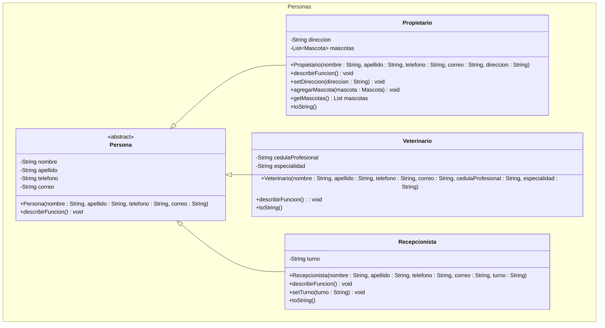

# Diagrama de Clases UML

```mermaid
classDiagram
    %% Paquete personas
    namespace Personas {
        
        class Persona{
            <<abstract>>
            -String nombre
            -String apellido
            -String telefono
            -String correo
            +Persona(nombre : String, apellido : String, telefono : String, correo : String)
            +describirFuncion()*  void
        }   
        class Propietario{
            -String direccion
            -List~Mascota~ mascotas
            +Propietario(nombre : String, apellido : String, telefono : String, correo : String, direccion : String )
            +describirFuncion()void 
            +setDireccion(direccion : String)  void 
            +agregarMascota(mascota : Mascota)  void
            +getMascotas() List mascotas
            +toString()
        }
        class Veterinario{
            -String cedulaProfesional
            -String especialidad
            +Veterinario(nombre : String, apellido : String, telefono : String, correo : String, cedulaProfesional : String, especialidad : String)
            +describirFuncion() : void  
            +toString()
        }
        class Recepcionista{
            -String turno
            +Recepcionista(nombre : String, apellido : String, telefono : String, correo : String, turno : String) 
            +describirFuncion() void 
            +setTurno(turno : String)  void 
            +toString()
        }
    }
    %% Herencias
    Persona <|-- Propietario
    Persona <|-- Veterinario
    Persona <|--Recepcionista
    
    
```
